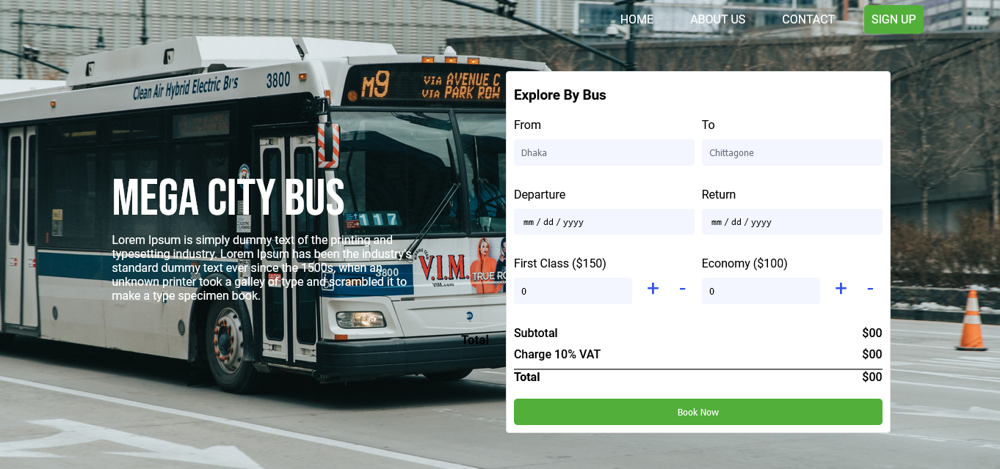

## Title-Info
> It is a Javascript Dom project called "Ninja Ticket For Bus" with Programming Hero Team. It contains a header with home, about us, contact and two content, one for some text another for a form. 😃😅 

## ScreenShots

## Built With
- HTML
- CSS3
- JavaScript
- VScode

## Getting Started
To get a local copy up and running you just need to follow the following steps;
- Clone this repository with
git clone https://github.com/asifmuntasir/MegaCityBus.git using your terminal or command line.
- run code `.` to open it in vscode
- then open your vscode live server
- and enjoy the site

## Author

👤 **Asif Muntasir**

- GitHub: [AsifMuntasir](https://github.com/asifmuntasir)
- LinkedIn: [AsifMuntasir](https://www.linkedin.com/in/asif-muntasir-shuaib/)
- Website: [AsifMuntasir](https://asifmuntasir.github.io/)

## 🤝 Contributing

Contributions, issues, and feature requests are welcome!

Feel free to check the [issues page](../../issues/).

## Show your support

Give a ⭐️ if you like this project!

## Acknowledgments

- Programming Hero Team

## 📝 License

This project is [MIT](./MIT.md) licensed.